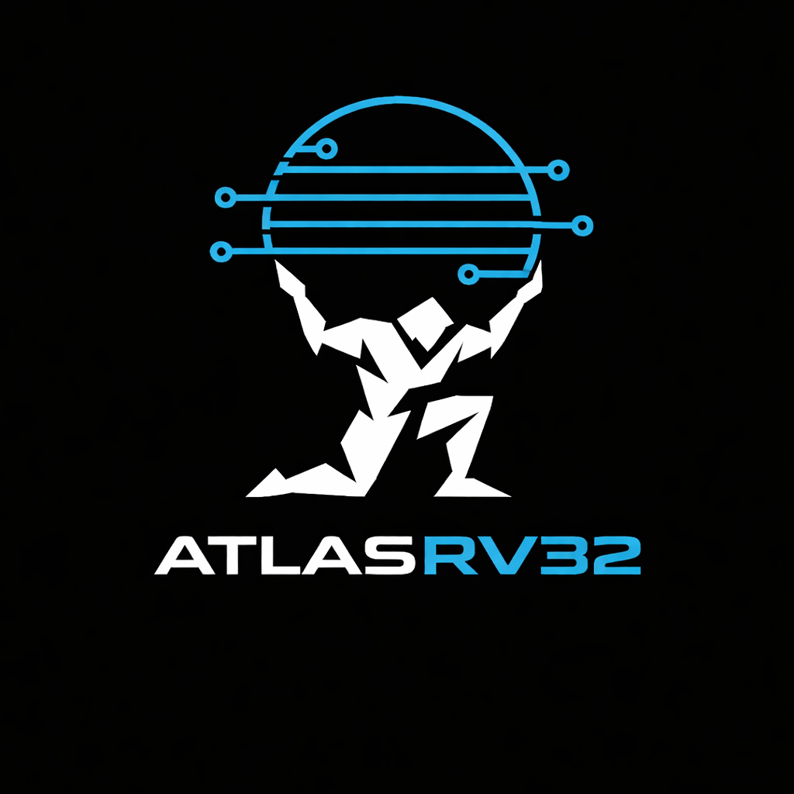

# AtlasRV32 — 32-bit RISC-V Pipelined Processor


<p align="center">
  
</p>

A synthesizable, 32-bit RISC-V processor implementing the RV32I base integer instruction set with a classic 5-stage pipeline, full hazard detection, and data forwarding. Synthesized and verified on FPGA.

---

## Pipeline Architecture

<p align="center">
  
</p>

| Stage | Module | Description |
|-------|--------|-------------|
| **IF**  | `if_stage.sv`  | PC register, instruction memory read |
| **ID**  | `id_stage.sv`  | Instruction decode, register file read, immediate extension |
| **EX**  | `ex_stage.sv`  | ALU execution, forwarding muxes, branch target |
| **MEM** | `mem_stage.sv` | Data memory read/write (LW, SW, LH, LB) |
| **WB**  | `wb_stage.sv`  | Result mux → register file writeback |

---

## Features

- **RV32I Base ISA** – R, I, S, B, U, J instruction formats
- **5-Stage Pipeline** – Full instruction-level parallelism
- **Hazard Detection Unit** – Detects load-use hazards; inserts stall bubbles
- **Forwarding Unit** – EX/MEM → EX and MEM/WB → EX forwarding paths to resolve RAW data hazards without stalling
- **Branch Handling** – Predict-not-taken; flushes pipeline on taken branch
- **FPGA Synthesis** – Targets Xilinx Artix-7 (Basys3 / Nexys A7) via Vivado
- **Constrained-Random Testbench** – Directed and random stimulus with self-checking assertions

---

## Hazard Handling

### Data Forwarding

Two forwarding paths eliminate most pipeline stalls caused by RAW (Read-After-Write) data hazards:

<p align="center">
  
</p>

### Load-Use Stall

When a load instruction is immediately followed by a dependent instruction, one stall cycle is inserted:

<p align="center">
  
</p>

### Branch Flush

On a taken branch or JAL/JALR, the two incorrectly fetched instructions are flushed:

<p align="center">
  
</p>

---

## Supported Instructions

<p align="center">
  
</p>

| Category | Instructions |
|----------|-------------|
| R-type   | ADD, SUB, AND, OR, XOR, SLL, SRL, SRA, SLT, SLTU |
| I-type   | ADDI, ANDI, ORI, XORI, SLLI, SRLI, SRAI, SLTI, SLTIU |
| Load     | LW, LH, LB, LHU, LBU |
| Store    | SW, SH, SB |
| Branch   | BEQ, BNE, BLT, BGE, BLTU, BGEU |
| Jump     | JAL, JALR |
| Upper    | LUI, AUIPC |

---

## Repository Structure

```
AtlasRV32/
├── rtl/
│   ├── alu.sv                    # 32-bit ALU (ADD/SUB/AND/OR/XOR/SLL/SRL/SRA/SLT)
│   ├── control_unit.sv           # Main decoder + ALU decoder
│   ├── register_file.sv          # 32×32 register file (x0 hardwired to 0)
│   ├── imm_extend.sv             # Immediate sign extension (I/S/B/U/J formats)
│   ├── riscv_core.sv             # Top-level core with pipeline registers
│   ├── top.sv                    # FPGA wrapper (clock divider, reset sync)
│   ├── pipeline/
│   │   ├── if_stage.sv           # Instruction Fetch
│   │   ├── id_stage.sv           # Instruction Decode
│   │   ├── ex_stage.sv           # Execute
│   │   ├── mem_stage.sv          # Memory Access
│   │   └── wb_stage.sv           # Write Back
│   └── hazard/
│       ├── hazard_detection.sv   # Load-use stall + branch flush
│       └── forwarding_unit.sv    # EX/MEM and MEM/WB forwarding
├── docs/
│   ├── atlasrv_logo.png
│   ├── Pipeline Architecture.png
│   ├── Data Forwarding.png
│   ├── Load-Use Stall.png
│   ├── Branch Flush.png
│   └── instruction_formats.png
├── sim/
│   ├── tb_top.sv                 # Directed + constrained-random testbench
│   └── run.do                    # ModelSim compile & wave script
├── fpga/
│   ├── constraints.xdc           # Basys3 / Nexys A7 pin assignments & timing
│   └── vivado_build.tcl          # Non-project Vivado synthesis + bitstream
├── software/
│   ├── test_program.S            # RISC-V assembly test program
│   └── program.hex               # Pre-assembled machine code (readmemh format)
└── README.md
```

---

## Simulation

### ModelSim

```bash
cd sim
vsim -do run.do
```

This will compile all RTL sources, run the testbench, and open a waveform window showing all pipeline stage signals, hazard signals, and forwarding controls.

### Icarus Verilog (open-source)

```bash
iverilog -g2012 -o sim_out \
  rtl/alu.sv rtl/register_file.sv rtl/control_unit.sv rtl/imm_extend.sv \
  rtl/pipeline/*.sv rtl/hazard/*.sv rtl/riscv_core.sv \
  sim/tb_top.sv
vvp sim_out
gtkwave sim/dump.vcd
```

---

## FPGA Synthesis

### Requirements
- Xilinx Vivado 2022.x or later
- Basys3 or Nexys A7 development board

### Build

```bash
vivado -mode batch -source fpga/vivado_build.tcl
```

Synthesis reports are written to `fpga/output/`:
- `post_synth_util.rpt`  – LUT/FF/BRAM utilisation
- `post_route_timing.rpt` – timing closure summary
- `power.rpt` – on-chip power estimate

---

## Technologies

- **RTL**: SystemVerilog (IEEE 1800-2017)
- **Simulation**: ModelSim / Icarus Verilog + GTKWave
- **Synthesis**: Xilinx Vivado
- **Target FPGA**: Artix-7 (xc7a35tcpg236-1)
- **ISA**: RISC-V RV32I

---

## Performance

The design targets > 50 MHz after place-and-route on Artix-7. Ideal CPI = 1.0; actual CPI depends on hazard frequency in the workload (typically 1.05–1.20 for typical RV32I programs).

---

## Author

**Ismail Hajjy**  
**ismailhajjy02@gmail.com**